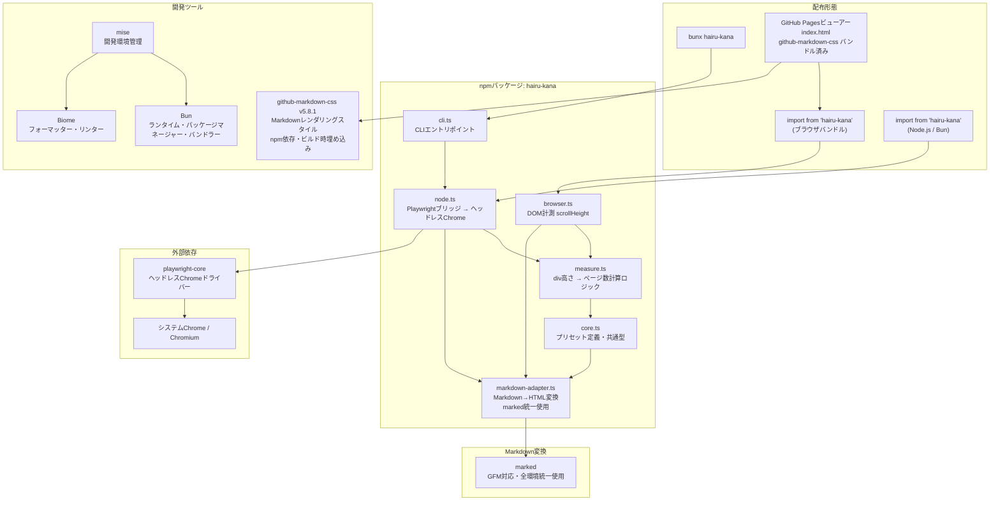
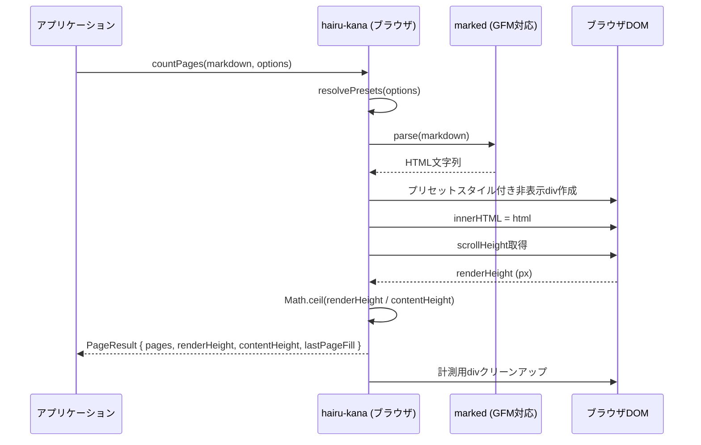
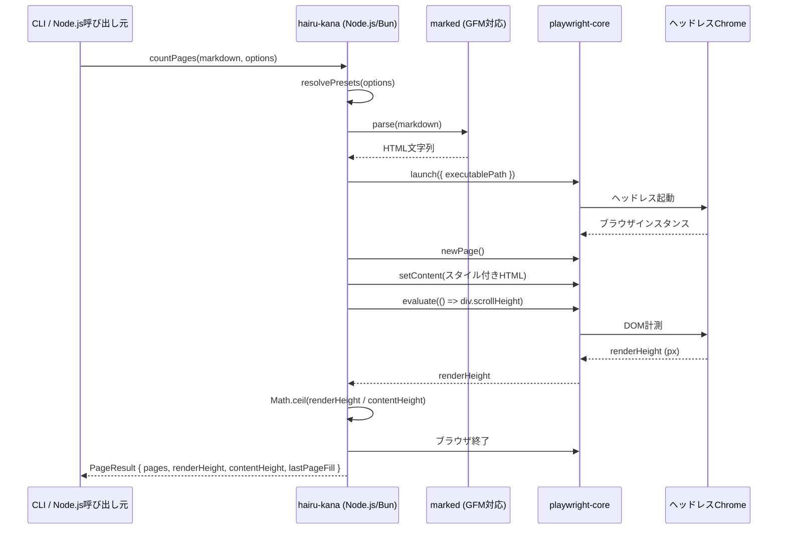

# 設計ドキュメント: hairu-kana (入るかな)

## 概要

hairu-kana は、Markdownドキュメントを用紙（A4、B5、A3）にレンダリングした場合に何ページになるかを計測するOSSライブラリです。単純な文字数カウントではなく、見出し・テーブル・コードブロックなどを含む実際のレンダリング高さを計算し、「情報密度」を正確に測定します。

ブラウザとNode.js/Bunの両環境で動作するデュアルモード設計です。ブラウザではdivの高さを直接計測し、Node.js/BunではPlaywrightを使ってヘッドレスChromeで同じdiv高さ計測を行います。どちらもChromeのレイアウトエンジンを使用するため、精度は同一です。ユーザーが制御するのは用紙サイズ（B5/A4/A3）のみで、フォントサイズ・行間は `github-markdown-css` が定義する標準値（`font-size: 16px`、`line-height: 1.5`）をそのまま使用します。将来的にカスタムCSS機能で対応する可能性があります。

GitHub Flavored Markdown（GFM）に対応し、テーブル・取り消し線・タスクリストなどの拡張構文も正確にレンダリング・計測します。Markdown→HTML変換には全環境で `marked` を統一使用し、環境間のHTML出力差異を排除して環境パリティを完全保証します。

npmモジュールとして配布し、条件付きエクスポート（`"browser"` でブラウザ用、`"default"` でNode.js/Bun用）、CLIツール（`bunx hairu-kana report.md`）、およびブラウザビルドを使用するGitHub Pagesビューアーを提供します。

### 開発ツールチェーン

- **開発環境管理**: [mise (mise-en-place)](https://github.com/jdx/mise) — 開発ツールのバージョンを `mise.toml` で宣言的に管理。Biomeのバージョンを固定
- **ランタイム/パッケージマネージャー**: Bun（mise経由でインストール、バージョン固定なし） — TypeScriptネイティブ実行、高速パッケージ管理、ビルトインバンドラー・テストランナー
- **Markdown→HTML変換**: [marked](https://github.com/markedjs/marked) — 全環境（ブラウザ・Node.js/Bun・CLI）で統一使用。GFM対応。環境間のHTML出力差異を排除し、環境パリティを完全保証
- **Markdownレンダリングスタイル**: [github-markdown-css](https://github.com/sindresorhus/github-markdown-css) v5.8.1 — GitHubの実CSSから自動生成されたMarkdownスタイル。npm依存として取り込み、ビルド時に `github-markdown-light.css` を計測用HTMLテンプレートに埋め込む。CDN依存なし。`font-size: 16px`、`line-height: 1.5` 等のスタイルをそのまま使用
- **バンドラー**: `Bun.build()`（Bunビルトイン） — ESM/CJS出力、browser/nodeターゲット対応。tsup不要
- **フォーマッター/リンター**: Biome（mise経由でインストール、aquaバックエンド経由でRustバイナリを直接取得） — ESLint + Prettierの統合代替。高速で設定がシンプル
- **テストランナー**: `bun test`（ユニットテスト）+ Vitest（ブラウザ統合テスト）

## アーキテクチャ



## シーケンス図

### ブラウザフロー



### Node.js / Bun / CLIフロー



## コンポーネントとインターフェース

### コンポーネント1: Core (core.ts)

**目的**: 共通型定義、プリセット値を提供する。

```typescript
// === 用紙サイズプリセット ===
interface PaperDimensions {
  /** 96dpiでの総幅 (px) */
  width: number
  /** 96dpiでの総高さ (px) */
  height: number
  /** 水平マージン (px、左右) */
  marginH: number
  /** 垂直マージン (px、上下) */
  marginV: number
}

type PaperSize = "b5" | "a4" | "a3"

interface MeasureOptions {
  paper?: PaperSize // デフォルト: "a4"
}

interface PageResult {
  /** ページ数（コンテンツが空でなければ1以上） */
  pages: number
  /** レンダリング後の総高さ (px) */
  renderHeight: number
  /** 1ページあたりのコンテンツ領域高さ (px) */
  contentHeight: number
  /** 最終ページの充填率 0.0〜1.0 */
  lastPageFill: number
  /** 計測に使用した解決済みプリセット値 */
  presets: ResolvedPresets
}

interface ResolvedPresets {
  paper: PaperDimensions
}
```

**責務**:
- 用紙サイズプリセットルックアップテーブルの定義とエクスポート
- ユーザー向けプリセットキーから具体的なピクセル値への解決
- レンダリングHTMLをスタイル付きコンテナでラップする `buildMeasurementHTML()` ヘルパーの提供

### コンポーネント2: Markdownアダプター (markdown-adapter.ts)

**目的**: Markdown→HTML変換を提供する。全環境で `marked` を統一使用し、GFM対応を保証する。

```typescript
/**
 * Markdown → HTML変換
 * 全環境（ブラウザ・Node.js/Bun）で marked を統一使用
 * GFM（テーブル、取り消し線、タスクリスト）に対応
 */
function markdownToHTML(markdown: string): string
```

**責務**:
- `marked` をGFM設定で呼び出し
- 全環境で一貫したHTML出力を保証

### コンポーネント3: Measure (measure.ts)

**目的**: 純粋な計算ロジック — レンダリング高さとコンテンツ高さからページ数と充填率を算出する。

```typescript
interface MeasureInput {
  renderHeight: number
  contentHeight: number
}

function calculatePages(input: MeasureInput): {
  pages: number
  lastPageFill: number
}
```

**責務**:
- `pages = Math.ceil(renderHeight / contentHeight)` の計算
- `lastPageFill = (renderHeight % contentHeight) / contentHeight` の計算（ちょうど埋まる場合は1.0）
- エッジケース処理: 空コンテンツ → `{ pages: 0, lastPageFill: 0 }`

### コンポーネント4: ブラウザエントリ (browser.ts)

**目的**: ブラウザ固有の実装。ライブDOMを使用してdiv高さを計測する。

```typescript
function countPages(
  markdown: string,
  options?: MeasureOptions,
): Promise<PageResult>
```

**責務**:
- 非表示のオフスクリーンdiv要素の作成
- プリセットスタイル（幅）の適用。フォントサイズ・行間は `github-markdown-css` の `markdown-body` クラスが定義する値をそのまま使用
- `markdownToHTML()` でHTML変換（marked使用）
- レイアウト後の `scrollHeight` 読み取り
- 計測用divのクリーンアップ
- `PageResult` の返却

### コンポーネント5: Node.js/Bunエントリ (node.ts)

**目的**: Node.js/Bun固有の実装。Playwrightを使用してヘッドレスChromeで計測する。

```typescript
function countPages(
  markdown: string,
  options?: MeasureOptions,
): Promise<PageResult>

/** バッチ処理用 — 単一ブラウザインスタンスを再利用 */
function createCounter(): Promise<{
  countPages: (
    markdown: string,
    options?: MeasureOptions,
  ) => Promise<PageResult>
  close: () => Promise<void>
}>
```

**責務**:
- `markdownToHTML()` でHTML変換（marked使用）
- `playwright-core` 経由でヘッドレスChromeを起動（システムインストール済みChromeを使用）
- `github-markdown-css` のスタイルを埋め込んだ自己完結型HTMLページの読み込み
- `page.evaluate()` による `scrollHeight` 計測の実行
- 計測後のブラウザ終了（バッチモードでは `createCounter()` で維持）
- `PageResult` の返却

### コンポーネント6: CLI (cli.ts)

**目的**: Markdownファイルを計測するコマンドラインインターフェース。

```
使い方: hairu-kana <file.md> [オプション]

オプション:
  --paper <b5|a4|a3>           用紙サイズ (デフォルト: a4)
  --json                       JSON形式で出力
  --help                       ヘルプ表示
```

**責務**:
- CLI引数のパース
- ディスクからMarkdownファイルの読み込み
- Node.js/Bunエントリの `countPages()` 呼び出し
- 結果のフォーマットと標準出力への表示

## データモデル

### プリセットルックアップテーブル

```typescript
const PAPER_PRESETS: Record<PaperSize, PaperDimensions> = {
  b5: { width: 669, height: 945, marginH: 91, marginV: 91 },
  a4: { width: 794, height: 1123, marginH: 120, marginV: 96 },
  a3: { width: 1123, height: 1587, marginH: 120, marginV: 96 },
}
```

**バリデーションルール**:
- `PaperSize` は `"b5" | "a4" | "a3"` のいずれか
- 全ピクセル値はmm寸法からの96dpi換算に基づく
- マージン値は各用紙サイズのMicrosoft Word標準マージンに準拠

### Markdown変換（全環境統一実装）

```typescript
// 全環境（ブラウザ・Node.js/Bun）で marked を統一使用
function markdownToHTML(markdown: string): string {
  if (!markdown.trim()) return ""
  return marked.parse(markdown, { gfm: true })
}
```

### 計測用HTMLテンプレート

```typescript
function buildMeasurementHTML(
  renderedHTML: string,
  presets: ResolvedPresets,
): string
```

計測用の自己完結型HTML文字列を生成する。`github-markdown-css` のスタイルを埋め込み、`markdown-body` クラスを付与したコンテナでレンダリングする。フォントサイズ・行間は `github-markdown-css` が定義する値（`font-size: 16px`、`line-height: 1.5`）をそのまま使用し、インラインスタイルでの上書きは行わない。

```typescript
// 計測用HTMLの構造イメージ
const contentWidth = presets.paper.width - 2 * presets.paper.marginH

const html = `
<style>
  /* github-markdown-css のスタイルを埋め込み */
  ${githubMarkdownCSS}
</style>
<div id="hairu-kana-measure"
     class="markdown-body"
     style="width: ${contentWidth}px;">
  ${renderedHTML}
</div>
`
```

以下を含む自己完結型HTML文字列を生成:
- `contentWidth` px（`paper.width - 2 * paper.marginH`）のコンテナdiv
- `github-markdown-css` による `markdown-body` クラスのスタイル適用（GitHubスタイルのMarkdownレンダリング）
- フォントサイズ・行間は `github-markdown-css` の定義に委任（`font-size: 16px`、`line-height: 1.5`、見出しサイズ比率等）
- GFM拡張要素のCSS（取り消し線、タスクリスト、テーブル）
- コンテナ内のレンダリング済みHTMLコンテンツ

**CSS詳細度の競合リスクについて**:
- 用紙サイズパラメータは `github-markdown-css` と競合しない
  - 用紙サイズはコンテナdivの `width` を決めるだけ
  - `github-markdown-css` はコンテナの中身のスタイルを定義
  - 両者は異なるレイヤーで動作するため干渉しない
- フォントサイズ・行間を上書きしないので、CSS詳細度の問題は発生しない

## 主要関数の形式仕様

### 関数1: resolvePresets()

```typescript
function resolvePresets(options?: MeasureOptions): ResolvedPresets
```

**事前条件:**
- `options` は `undefined` または有効な `MeasureOptions` オブジェクト
- `paper` フィールドが指定される場合、許可された列挙値のいずれか

**事後条件:**
- 全フィールドが設定された `ResolvedPresets` を返却
- 未指定フィールドのデフォルト値: `paper: "a4"`
- `result.paper` は `PAPER_PRESETS` の有効な `PaperDimensions`

**ループ不変条件:** N/A

### 関数2: markdownToHTML()

```typescript
function markdownToHTML(markdown: string): string
```

**事前条件:**
- `markdown` は文字列（空文字列可）

**事後条件:**
- 有効なHTML文字列を返却
- 空入力は空文字列を生成
- Markdown構文は対応するHTML要素に変換される
- GFM拡張（テーブル、取り消し線、タスクリスト）が正しく変換される
- 出力にscriptタグやイベントハンドラを含まない
- 全環境で `marked` を使用し、一貫したHTML出力を保証

**ループ不変条件:** N/A

### 関数3: calculatePages()

```typescript
function calculatePages(input: MeasureInput): {
  pages: number
  lastPageFill: number
}
```

**事前条件:**
- `input.renderHeight >= 0`
- `input.contentHeight > 0`

**事後条件:**
- `renderHeight === 0` の場合: `{ pages: 0, lastPageFill: 0 }` を返却
- `renderHeight > 0` の場合: `pages === Math.ceil(renderHeight / contentHeight)`
- `0 <= lastPageFill <= 1.0`
- コンテンツがちょうど最終ページを埋める場合 `lastPageFill === 1.0`
- `pages * contentHeight >= renderHeight`（ページ数は常にコンテンツを収容するのに十分）

**ループ不変条件:** N/A

### 関数4: countPages() — ブラウザ

```typescript
async function countPages(
  markdown: string,
  options?: MeasureOptions,
): Promise<PageResult>
```

**事前条件:**
- DOMアクセス可能なブラウザ環境で実行
- `document.createElement` が利用可能
- `markdown` は文字列

**事後条件:**
- 有効な `PageResult` を返却
- 計測後にDOM要素が残らない（クリーンアップ保証）
- `result.pages >= 0`
- `result.lastPageFill` は 0.0〜1.0 の範囲
- `result.presets` は使用された解決済みプリセット値を反映
- 空のmarkdown → `result.pages === 0`

**ループ不変条件:** N/A

### 関数5: countPages() — Node.js / Bun

```typescript
async function countPages(
  markdown: string,
  options?: MeasureOptions,
): Promise<PageResult>
```

**事前条件:**
- Node.jsまたはBun環境で実行
- Chrome/Chromiumがインストール済みで検出可能（`CHROME_PATH` 環境変数またはデフォルトパス）
- `playwright-core` が利用可能

**事後条件:**
- 同じ入力に対してブラウザ版と同一の `PageResult` を返却
- 呼び出し内でブラウザプロセスが起動・終了される（プロセスリークなし）
- `result.pages >= 0`
- `result.lastPageFill` は 0.0〜1.0 の範囲
- 空のmarkdown → `result.pages === 0`

**ループ不変条件:** N/A

### 関数6: createCounter() — バッチモード

```typescript
async function createCounter(): Promise<{
  countPages: (
    markdown: string,
    options?: MeasureOptions,
  ) => Promise<PageResult>
  close: () => Promise<void>
}>
```

**事前条件:**
- Node.js/Bun `countPages()` と同じ

**事後条件:**
- `countPages` と `close` メソッドを持つオブジェクトを返却
- ブラウザインスタンスは複数の `countPages` 呼び出しで再利用される
- `close()` 呼び出し後、ブラウザプロセスは終了される
- `close()` 後の `countPages` 呼び出しはエラーをスローする
- 複数の並行 `countPages` 呼び出しは安全（各呼び出しが別ページを使用）

**ループ不変条件:** N/A

## アルゴリズム擬似コード

### Markdownアダプター（marked統一使用）

```typescript
function markdownToHTML(markdown: string): string {
  if (!markdown.trim()) return ""

  // 全環境で marked を統一使用
  return marked.parse(markdown, { gfm: true })
}
```

### メイン計測アルゴリズム（ブラウザ）

```typescript
async function countPages(
  markdown: string,
  options?: MeasureOptions,
): Promise<PageResult> {
  // ステップ1: プリセット解決
  const presets = resolvePresets(options)
  const contentWidth = presets.paper.width - 2 * presets.paper.marginH
  const contentHeight = presets.paper.height - 2 * presets.paper.marginV

  // ステップ2: Markdown → HTML変換（marked使用）
  const html = markdownToHTML(markdown)

  // ステップ3: 非表示計測用div作成（github-markdown-cssのスタイルを適用）
  const measureDiv = document.createElement("div")
  measureDiv.className = "markdown-body"
  measureDiv.style.position = "fixed"
  measureDiv.style.visibility = "hidden"
  measureDiv.style.top = "-99999px"
  measureDiv.style.width = `${contentWidth}px`
  // フォントサイズ・行間は github-markdown-css の markdown-body クラスに委任
  measureDiv.innerHTML = html
  document.body.appendChild(measureDiv)

  // ステップ4: レンダリング高さ計測
  const renderHeight = await new Promise<number>((resolve) => {
    requestAnimationFrame(() => resolve(measureDiv.scrollHeight))
  })

  // ステップ5: クリーンアップ
  document.body.removeChild(measureDiv)

  // ステップ6: ページ数計算
  const { pages, lastPageFill } = calculatePages({
    renderHeight,
    contentHeight,
  })

  return { pages, renderHeight, contentHeight, lastPageFill, presets }
}
```

### Node.js / Bun 計測アルゴリズム

```typescript
async function countPages(
  markdown: string,
  options?: MeasureOptions,
): Promise<PageResult> {
  // ステップ1: プリセット解決と計測用HTML構築
  const presets = resolvePresets(options)
  const contentWidth = presets.paper.width - 2 * presets.paper.marginH
  const contentHeight = presets.paper.height - 2 * presets.paper.marginV
  const html = markdownToHTML(markdown) // marked使用
  const fullHTML = buildMeasurementHTML(html, presets)

  // ステップ2: Playwright経由でヘッドレスChrome起動
  const browser = await chromium.launch({
    executablePath: findChromePath(),
    headless: true,
  })

  try {
    // ステップ3: ページ作成とコンテンツ読み込み
    const page = await browser.newPage()
    await page.setContent(fullHTML, { waitUntil: "load" })

    // ステップ4: DOM評価によるレンダリング高さ計測
    const renderHeight = await page.evaluate(() => {
      const el = document.getElementById("hairu-kana-measure")
      return el ? el.scrollHeight : 0
    })

    // ステップ5: ページ数計算
    const { pages, lastPageFill } = calculatePages({
      renderHeight,
      contentHeight,
    })

    return { pages, renderHeight, contentHeight, lastPageFill, presets }
  } finally {
    // ステップ6: ブラウザを必ず終了
    await browser.close()
  }
}
```

### Chromeパス探索アルゴリズム

```typescript
function findChromePath(): string {
  // 優先度1: 明示的な環境変数
  if (process.env.CHROME_PATH) {
    return process.env.CHROME_PATH
  }

  // 優先度2: プラットフォーム固有のデフォルトパス
  const platform = process.platform
  const candidates: string[] = []

  if (platform === "darwin") {
    candidates.push(
      "/Applications/Google Chrome.app/Contents/MacOS/Google Chrome",
    )
    candidates.push("/Applications/Chromium.app/Contents/MacOS/Chromium")
  } else if (platform === "win32") {
    candidates.push(
      "C:\\Program Files\\Google\\Chrome\\Application\\chrome.exe",
    )
    candidates.push(
      "C:\\Program Files (x86)\\Google\\Chrome\\Application\\chrome.exe",
    )
  } else {
    // Linux
    candidates.push("/usr/bin/google-chrome")
    candidates.push("/usr/bin/google-chrome-stable")
    candidates.push("/usr/bin/chromium-browser")
    candidates.push("/usr/bin/chromium")
  }

  // 最初に見つかったパスを返却、なければエラー
  for (const candidate of candidates) {
    if (existsSync(candidate)) return candidate
  }

  throw new Error(
    "Chromeが見つかりません。Chromeをインストールするか、CHROME_PATH環境変数を設定してください。",
  )
}
```

## 使用例

```typescript
// === ブラウザでの使用 ===
import { countPages } from "hairu-kana"

const markdown = `# 月次レポート\n\n## 概要\n\nLorem ipsum...`

const result = await countPages(markdown, { paper: "a4" })

console.log(
  `${result.pages}ページ（最終ページ ${Math.round(result.lastPageFill * 100)}% 使用）`,
)
// → "2ページ（最終ページ 72% 使用）"

// === Node.js / Bunでの使用（同じAPI） ===
import { countPages } from "hairu-kana"

const result = await countPages(markdown, { paper: "b5" })

// === バッチモード ===
import { createCounter } from "hairu-kana"

const counter = await createCounter()
try {
  for (const file of markdownFiles) {
    const md = await Bun.file(file).text()
    const result = await counter.countPages(md, { paper: "a4" })
    console.log(`${file}: ${result.pages}ページ`)
  }
} finally {
  await counter.close()
}

// === GFM対応の例 ===
const gfmMarkdown = `
# タスク一覧

| タスク | 状態 |
|--------|------|
| 設計   | ~~完了~~ |
| 実装   | 進行中 |

- [x] 要件定義
- [ ] テスト
`
const result = await countPages(gfmMarkdown, { paper: "a4" })

// === CLI ===
// $ bunx hairu-kana report.md
// → report.md: 3ページ (A4)

// $ bunx hairu-kana report.md --paper b5 --json
// → {"pages":4,"renderHeight":3520,"contentHeight":763,...}
```

## Correctness Properties

*A property is a characteristic or behavior that should hold true across all valid executions of a system — essentially, a formal statement about what the system should do. Properties serve as the bridge between human-readable specifications and machine-verifiable correctness guarantees.*

### Property 1: Markdown変換の正しさ

*For any* Markdown string, if the string is empty or composed entirely of whitespace characters, markdownToHTML SHALL return an empty string; otherwise, markdownToHTML SHALL return a non-empty HTML string.

**Validates: Requirements 1.1, 1.2**

### Property 2: 無効プリセットのエラー

*For any* string that is not one of the valid PaperSize keys ("b5", "a4", "a3"), resolvePresets SHALL throw a HairuKanaError.

**Validates: Requirement 2.4**

### Property 3: ページ数計算の正しさ

*For any* positive renderHeight and positive contentHeight, calculatePages SHALL return pages equal to Math.ceil(renderHeight / contentHeight), and pages multiplied by contentHeight SHALL be greater than or equal to renderHeight.

**Validates: Requirements 3.1, 3.5**

### Property 4: lastPageFillの正しさ

*For any* positive renderHeight and positive contentHeight, calculatePages SHALL return lastPageFill in the range (0.0, 1.0]. When renderHeight is an exact multiple of contentHeight, lastPageFill SHALL equal 1.0.

**Validates: Requirements 3.3, 3.4**

### Property 5: 空入力

*For any* MeasureOptions, countPages called with an empty string SHALL return pages equal to 0 and lastPageFill equal to 0.

**Validates: Requirements 3.2, 4.4, 5.3**

### Property 6: DOMクリーンアップ

*For any* Markdown string and MeasureOptions, after Browser_Counter.countPages completes, no measurement div elements SHALL remain in the DOM.

**Validates: Requirement 4.3**

### Property 7: PageResult構造の妥当性

*For any* Markdown string and MeasureOptions, countPages SHALL return a PageResult containing pages (non-negative integer), renderHeight (non-negative number), contentHeight (positive number), lastPageFill (number in [0, 1]), and presets (valid ResolvedPresets object).

**Validates: Requirement 4.5**

### Property 8: 用紙サイズの単調性

*For any* non-empty Markdown string, countPages with paper "a3" SHALL return pages less than or equal to countPages with paper "a4", and countPages with paper "a4" SHALL return pages less than or equal to countPages with paper "b5".

**Validates: Requirement 9.1**

### Property 9: 決定性

*For any* Markdown string and MeasureOptions, calling countPages twice with the same arguments SHALL return identical PageResult values.

**Validates: Requirement 10.1**

### Property 10: CSS非上書き

*For any* PaperSize, the generated measurement HTML SHALL set the container width but SHALL NOT contain inline font-size or line-height style overrides on the measurement container.

**Validates: Requirement 13.3**

### Property 11: コンテンツ追加の単調性

*For any* Markdown string m1 and additional content string, if m2 = m1 + additional content, then countPages(m2, options).pages SHALL be greater than or equal to countPages(m1, options).pages.

**Validates: Requirement 9.1**

### Property 12: プリセットデフォルト

*For any* Markdown string, countPages(md) and countPages(md, {}) SHALL return identical PageResult values (both defaulting to A4).

**Validates: Requirements 2.2, 2.3**

## エラーハンドリング

### エラーシナリオ1: Chromeが見つからない（Node.js / Bun）

**条件**: `CHROME_PATH` またはデフォルトシステムパスにChrome/Chromiumバイナリが見つからない
**応答**: `HairuKanaError` をスロー: `"Chromeが見つかりません。Chromeをインストールするか、CHROME_PATH環境変数を設定してください。"`
**復旧**: ユーザーがChromeをインストールまたは `CHROME_PATH` を設定

### エラーシナリオ2: 無効なプリセット値

**条件**: 認識されないプリセットキーが渡された場合（例: `paper: "letter"`）
**応答**: `HairuKanaError` をスロー: `"無効な用紙サイズ 'letter'。有効なオプション: b5, a4, a3"`
**復旧**: ユーザーがオプション値を修正

### エラーシナリオ3: Playwrightが未インストール（Node.js / Bun）

**条件**: 実行時に `playwright-core` が利用不可
**応答**: `HairuKanaError` をスロー: `"Node.js/Bunでの使用にはplaywright-coreが必要です。実行: bun add playwright-core"`
**復旧**: ユーザーが依存関係をインストール

### エラーシナリオ4: ブラウザ起動失敗

**条件**: Playwrightがchromeの起動に失敗（権限、破損バイナリなど）
**応答**: Playwrightエラーを `HairuKanaError` でラップし、コンテキスト情報を付加
**復旧**: ユーザーがChromeのインストールと権限を確認

### エラーシナリオ5: 計測タイムアウト

**条件**: DOM計測に時間がかかりすぎる（極端に大きなドキュメントなど）
**応答**: 設定可能な時間（デフォルト30秒）後にタイムアウト、`HairuKanaError` をスロー
**復旧**: ユーザーがドキュメントを分割またはタイムアウトを延長

## テスト戦略

### ユニットテスト

**テストランナー**: `bun test`（Bunビルトイン）

- `resolvePresets()` を全用紙サイズオプションとデフォルトでテスト
- `calculatePages()` を既知のrenderHeight/contentHeightペアでテスト
- `markdownToHTML()` を各種Markdown構文（GFM含む）でテスト
- `findChromePath()` をモックファイルシステムと環境変数でテスト
- CLI引数パースを各種フラグ組み合わせでテスト

### プロパティベーステスト

**テストライブラリ**: fast-check

ランダム入力でテストする主要プロパティ:
- `calculatePages` は常に `pages >= 0` かつ `0 <= lastPageFill <= 1` を返す
- `calculatePages` で `renderHeight = n * contentHeight` の場合 `lastPageFill === 1.0` を返す
- `resolvePresets` は入力の組み合わせに関わらず常に有効なピクセル値を返す
- ページ数の単調性: コンテンツ追加でページ数は減少しない
- プリセット順序: 大きい用紙 → 少ないまたは同じページ数

### 統合テスト

**テストランナー**: Vitest（ブラウザモード対応）

- ブラウザE2Eテスト: 実ブラウザでライブラリを読み込み、既知のMarkdownを計測、ページ数を検証
- Node.js/Bun E2Eテスト: Playwrightで `countPages()` を実行、期待結果と照合
- CLIテスト: テスト用Markdownファイルでバイナリを実行、標準出力をパース
- クロス環境パリティテスト: 同じMarkdownをブラウザとNode.jsで計測し、同一の `pages` を確認
- GFMテスト: テーブル・取り消し線・タスクリストを含むMarkdownの計測検証

## 開発環境セットアップ

### 前提条件

- [mise](https://github.com/jdx/mise) がインストール済みであること
- Chrome/Chromium がインストール済みであること（Node.js/Bun計測用）

### セットアップ手順

```bash
# 1. リポジトリをクローン
git clone https://github.com/<owner>/hairu-kana.git
cd hairu-kana

# 2. mise でツールをインストール（Bun + Biome v1.9.4）
mise install

# 3. 依存パッケージをインストール
bun install

# 4. ビルド
bun run build

# 5. テスト
bun test
```

**注記**: `mise install` を実行すると、`mise.toml` に定義された Bun（最新版）と Biome v1.9.4 が自動的にインストールされる。Biome は mise の aqua バックエンド経由で Rust バイナリを直接取得するため、npm 経由より軽量かつ高速。

### プロジェクト構成

```
hairu-kana/
├── src/
│   ├── core.ts              # 共通型・プリセット定義（用紙サイズのみ）
│   ├── markdown-adapter.ts  # Markdown→HTML変換（marked統一使用）
│   ├── measure.ts           # ページ数計算
│   ├── browser.ts           # ブラウザエントリ
│   ├── node.ts              # Node.js/Bunエントリ
│   └── cli.ts               # CLIエントリポイント
├── test/
│   ├── core.test.ts
│   ├── measure.test.ts
│   ├── markdown-adapter.test.ts
│   └── integration.test.ts
├── viewer/
│   └── index.html           # GitHub Pagesビューアー（github-markdown-css バンドル済み）
├── build.ts                 # Bun.build() ビルドスクリプト
├── biome.json               # Biome設定（フォーマット・リント）
├── mise.toml                # mise設定（Biomeバージョン固定）
├── tsconfig.json
├── package.json
└── README.md
```

### mise.toml

```toml
[tools]
bun = "latest"
biome = "1.9.4"
```

**注記**: Bunのバージョンは固定しない（`latest` 相当）。`Bun.markdown` を使用しないため、特定バージョン以上の制約はない。mise自体は開発環境管理ツールとして残し、Biomeのバージョン固定等に使用する。

### ビルドスクリプト (build.ts)

```typescript
// ブラウザ向けビルド（marked をバンドル）
await Bun.build({
  entrypoints: ["./src/browser.ts"],
  outdir: "./dist",
  target: "browser",
  format: "esm",
  naming: "browser.mjs",
})

// Node.js/Bun向けビルド（ESM）
await Bun.build({
  entrypoints: ["./src/node.ts"],
  outdir: "./dist",
  target: "node",
  format: "esm",
  naming: "node.mjs",
  external: ["playwright-core"],
})

// Node.js向けビルド（CJS）
await Bun.build({
  entrypoints: ["./src/node.ts"],
  outdir: "./dist",
  target: "node",
  format: "cjs",
  naming: "node.cjs",
  external: ["playwright-core"],
})

// CLI向けビルド
await Bun.build({
  entrypoints: ["./src/cli.ts"],
  outdir: "./dist",
  target: "bun",
  format: "esm",
  naming: "cli.mjs",
  external: ["playwright-core"],
})
```

### Biome設定

Biome は mise 経由でインストールされるため、npm の `devDependencies` には含めない。

```json
{
  "$schema": "https://biomejs.dev/schemas/1.9.4/schema.json",
  "organizeImports": {
    "enabled": true
  },
  "formatter": {
    "enabled": true,
    "indentStyle": "tab",
    "lineWidth": 80
  },
  "linter": {
    "enabled": true,
    "rules": {
      "recommended": true
    }
  }
}
```

### package.json

```json
{
  "name": "hairu-kana",
  "version": "0.1.0",
  "description": "入るかな — Markdownドキュメントのページ数を計測するライブラリ",
  "scripts": {
    "build": "bun run build.ts",
    "test": "bun test",
    "test:integration": "vitest run",
    "lint": "biome check .",
    "lint:fix": "biome check --write .",
    "format": "biome format --write .",
    "check": "biome check --write . && bun test"
  },
  "exports": {
    ".": {
      "browser": "./dist/browser.mjs",
      "import": "./dist/node.mjs",
      "require": "./dist/node.cjs"
    }
  },
  "bin": {
    "hairu-kana": "./dist/cli.mjs"
  },
  "dependencies": {
    "github-markdown-css": "^5.8.1",
    "marked": "^15.0.0",
    "playwright-core": "^1.49.0"
  },
  "devDependencies": {
    "fast-check": "^3.0.0",
    "vitest": "^2.0.0"
  }
}
```

**注記**:
- `marked` は全環境（ブラウザ・Node.js/Bun）で統一使用するMarkdown→HTML変換ライブラリ。ブラウザビルドではバンドルされる。
- `github-markdown-css` は計測用HTMLテンプレートで `markdown-body` クラスのスタイルとして使用。ビューアーでも同じCSSをバンドルに含める（CDN依存なし）。
- `@biomejs/biome` はmise経由でインストールするため `devDependencies` には含めない。

## パフォーマンス考慮事項

- **ブラウザ**: 計測は高速（単一DOM操作）。非表示divアプローチは計測あたり約1〜5ms。通常の使用では最適化不要。
- **Node.js/Bun単発呼び出し**: Playwrightのブラウザ起動がボトルネック（コールドスタート約1〜2秒）。CLI用途では許容範囲。
- **バッチモード**: `createCounter()` でブラウザ起動コストを複数計測で償却。以降の各計測は約50〜100ms（ページ作成＋評価）。
- **大規模ドキュメント**: 数千行のドキュメントはレンダリングに時間がかかる可能性あり。30秒タイムアウトでハングを防止。
- **メモリ**: 非表示計測用divは計測直後にクリーンアップ。Playwrightページは単発呼び出しモードでは各計測後にクローズ。

## セキュリティ考慮事項

- **Markdownサニタイズ**: `marked` はデフォルトのサニタイズ設定で使用。ブラウザビューアーでのXSS防止のため、生HTMLのパススルーなし。
- **Playwrightサンドボックス**: ヘッドレスChromeはデフォルトのサンドボックスで実行。`--no-sandbox` フラグは使用しない。
- **ファイルアクセス（CLI）**: CLIは指定されたMarkdownファイルのみ読み取り。ユーザーが明示的に指定した範囲を超えるディレクトリトラバーサルやglob展開なし。
- **ネットワークアクセスなし**: 計測は完全にローカル。外部へのデータ送信なし。CDN依存なし。

## 依存関係

| 依存パッケージ | 目的 | 環境 |
|---|---|---|
| `github-markdown-css` | GitHubスタイルのMarkdownレンダリングCSS（`markdown-body` クラス）。`font-size: 16px`、`line-height: 1.5` 等のスタイルを提供 | 全環境（計測用HTML / ビューアー） |
| `marked` | Markdown → HTML変換（GFM対応）。全環境で統一使用 | 全環境 |
| `playwright-core` | ヘッドレスChromeドライバー（ブラウザ同梱なし） | Node.js/Bunのみ |
| `fast-check` | プロパティベーステスト | 開発/テスト |
| `vitest` | 統合テストランナー（ブラウザモード対応） | 開発/テスト |

### mise管理ツール

| ツール | バージョン | 目的 | インストール方法 |
|---|---|---|---|
| `bun` | latest | ランタイム・パッケージマネージャー・バンドラー・テストランナー | mise（公式バックエンド） |
| `biome` | 1.9.4 | フォーマッター・リンター統合ツール | mise（aquaバックエンド、Rustバイナリ直接取得） |

**注記**: `tsup` は不要（`Bun.build()` で代替）。`@biomejs/biome` はmise経由でインストールするため、npmの `devDependencies` には含めない。
